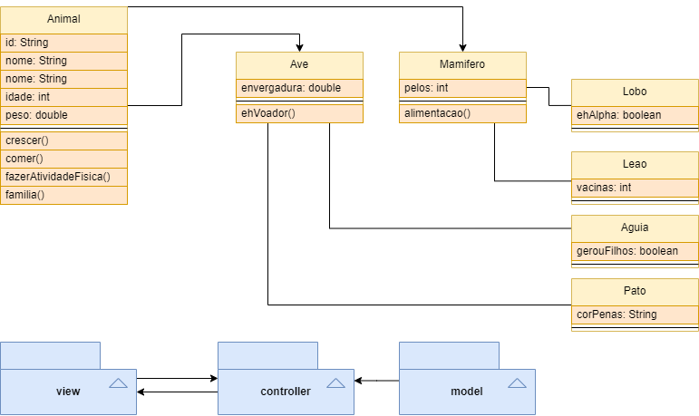

# Programa em Java para representar diferentes tipos de animais em um zoológico

## Documentação do projeto

- Projeto de um zoológico em Java para a disciplina de Programação do curso de sistemas para internet.

- O projeto consiste em um programa que simula um zoológico, onde o usuário pode inserir e remover animais, além de visualizar os animais cadastrados.

- O programa foi desenvolvido em Java, utilizando o vs code como editor de texto e o terminal do próprio vs code para compilar e executar o programa.

## Como executar

- Para executar o programa, é necessário ter o Java instalado na máquina. Caso não tenha, é possível baixar o Java no site da [Oracle](https://www.oracle.com/br/java/technologies/javase-downloads.html).

- Após instalar o Java, é necessário ter o vs code instalado na máquina. Caso não tenha, é possível baixar o vs code no site da [Microsoft](https://code.visualstudio.com/download).

- Após instalar o vs code, é necessário instalar a extensão do Java no vs code. Para isso, basta abrir o vs code, clicar no ícone de extensões (localizado no menu lateral esquerdo) e pesquisar por "Java Extension Pack". Após encontrar a extensão, basta clicar em "instalar".

- Após instalar a extensão do Java, é necessário instalar o Java Development Kit (JDK). Para isso, basta acessar o site da [Oracle](https://www.oracle.com/br/java/technologies/javase-jdk11-downloads.html) e baixar a versão mais recente do JDK.

- Depois de tudo isso instalado, basta abrir o projeto no vs code, clicar no botão "Run" (localizado no canto superior direito) para compilar e executar o programa.

## Como utilizar

- Ao executar o programa, o usuário terá acesso a um menu com 4 opções: inserir, remover, visualizar e sair.

- Ao selecionar a opção "inserir", o usuário terá acesso a um novo menu com 4 opções: leão, lobo, pato e águia. Ao selecionar uma das opções, o usuário será redirecionado para um novo menu, onde deverá inserir os dados do animal. Após inserir os dados, o animal será cadastrado e o usuário será redirecionado para o menu principal.

- Ao selecionar a opção "remover", o usuário deverá inserir o id do animal que deseja remover. Após inserir o id, o animal será removido e o usuário será redirecionado para o menu principal.

- Ao selecionar a opção "visualizar", o usuário terá acesso a uma lista com todos os animais cadastrados. Após visualizar a lista, o usuário será redirecionado para o menu principal.

- Ao selecionar a opção "sair", o programa será encerrado.

## Hierarquia de classes

1. A classe abstrata Animal é a classe base. Ela contém os seguintes atributos:

- id (identificador)
- nome
- idade
- peso

  Todo animal deve ser capaz de realizar as seguintes ações:

- crescer (mudar a idade anualmente)
- comer (aumentar uma unidade de peso)
- fazer atividades físicas (perder duas unidades de peso)

  Além disso, todo animal deve conter o método abstrato "familia", que irá imprimir a família biológica de cada classe de animal.

2. A partir da classe Animal, criamos duas subclasses: Mamífero e Ave.

- A classe Mamífero deve ter um atributo adicional para a quantidade de pelos.
- A classe Ave deve ter um atributo para a envergadura das asas.

  A classe Mamífero deve conter o método "alimentacao", que retorna do que ele se alimentou da última vez. Para isso, criamos um atributo "String alimento" para armazenar essa informação. Inicializamos como uma String vazia no construtor da classe Animal.

  A classe Ave contém o método "ehVoador", que diz se a ave em questão plana ou voa. Para isso, criamos um novo atributo "boolean voa" para armazenar essa informação. True se voa, false se não voa.

3. Em seguida, criamos duas subclasses para cada uma dessas classes:

- Para a classe Mamífero, criamos as classes Leao e Lobo.
- Para a classe Ave, criamos as classes Pato e Águia.

  Em cada uma, sobrescrevemos o método "ehVoador" para retornar se a ave plana ou voa (pato plana e águia voa). Cada uma dessas subclasses deve ter seus próprios atributos e métodos específicos:

- Na classe Leao, criamos um atributo "private int vacinas" que indica quantas vacinas o leão tomou e um método "getVacinas()" que retorna este atributo.

- Na classe Lobo, criamos um atributo "private boolean ehAlpha" que indica se aquele lobo é o alfa da alcateia ou não. Criamos um método "getElAlpha()" que retorna este atributo.

- Na classe Pato, criamos um atributo "private String corPenas" que indica a cor dominante do pato. Criamos um método "getCorPenas()" que retorna esse atributo.

- Na classe Águia, criamos um atributo "private boolean gerouFilhos" que indica se essa águia gerou filhos. Criamos um método "getGerouFilhos()" que retorna este atributo.

## Funções na Main

Na Main, criamos duas funções em um menu: inserir animais e remover animais.

1. A função "inserir" pergunta qual dos 4 animais o usuário deseja inserir. Ao selecionar, criamos o objeto Animal instanciado como a classe selecionada e adicionamos ao ArrayList de Animal (ex.: Animal a = new Leao(...)).

2. A função "remover" recebe dois parâmetros: um id e o ArrayList

3. A função "visualizar" recebe o ArrayList e imprime todos os animais cadastrados.

## Diagrama de classes

